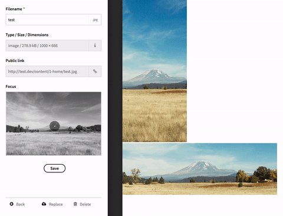

# Kirby Focus

 

With this plugin for [Kirby 2](http://getkirby.com) you can prevent the most important part of an image from being cropped when creating automated thumbs.

**The plugin does two things:**

1. It provides a **custom field** that allows you to set a focus point. The focus point is saved to the meta data file.
2. It provides a **new method** `focusCrop()`, which uses the focus point saved in the meta data file to crop an image in such a way that the focus point is in the center of the cropped image – or (if that's not possible) at least isn't cropped.


## Requirements

+ Kirby CMS, Version **2.3+**
+ GD Library or ImageMagick

## Please notice

Be aware that the plugin overrides the default thumbs driver for GD or ImageMagick as [described here](https://forum.getkirby.com/t/changing-toolkit-thumbs-drivers-scale-crop/2849/3?u=flokosiol).


## Preview




## Installation

Kirby Focus can be installed in different ways.

### Kirby CLI

If you are using the [Kirby CLI](https://github.com/getkirby/cli) you can install this plugin by running the following command in your shell from the root folder of your Kirby installation:

```
kirby plugin:install flokosiol/kirby-focus
```

### Download

Of course you can also download and unpack the zip file (or simply clone the repository). If necessary, rename the folder to `focus` and put it into `site/plugins` of your Kirby installation.

Please make sure, that the plugin folder structure looks like this:

```
site/plugins/focus/
```

### Git Submodule

If you want to add this plugin as a Git submodule.

```
$ cd your/project/root
$ git submodule add https://github.com/flokosiol/kirby-focus.git site/plugins/focus
```

## Usage

### 1. Blueprint

Add the focus field to the **file fields** (!) of your blueprint and make sure to name it `focus` like this:

```
files:
  fields:
    focus:
      label: My focus field
      type: focus
```

#### Optional setting

I recommend to keep the default field key. Nevertheless you are able to change it by adding the following line to your `config.php`:

```
c::set('focus.field.key', 'betterfocuskey');
```

The focus field has a maximum width of 300px. If you prefer to go fullwidth, you can add this to your `
config.php`:

```
c::set('focus.field.fullwidth', true);
```

If the default filename settings (considering dimensions, focus, quality, grayscale and blur) won't work for you, feel free to change it to the more flexible but less beatiful hash variant by adding the following line to your `config.php`:

```
c::set('focus.filename.hash', true);
```


### 2. Template

Use the `focusCrop()` method in your template to get a complete `` tag:

```
<?php
  // you need a Kirby image object like this
  $image = $page->images()->first();

  // crop a square of 200px x 200px
  echo $image->focusCrop(200);

  // crop a rectangle of 300px x 200px
  echo $image->focusCrop(300,200);

  // crop a rectangle of 200px x 400px with a quality of 80%
  echo $image->focusCrop(200,400,array('quality' => 80));

  // crop a grayscale square of 300px x 300px
  echo $image->focusCrop(300,300,['grayscale' => true]);

  // crop a rectangle of 200px x 300px and force coordinates (overrides user input)
  echo $image->focusCrop(200,300,['focusX' => 0.3, 'focusY' => 0.6]);
?>
```

As with every Kirby **image object** you can use all the known [methods](https://getkirby.com/docs/cheatsheet#file) like this:

```
<?php
  $url = $image->focusCrop(200,300)->url();
  $filename = $image->focusCrop(150)->filename();
?>
```

### Some more stuff …

The plugin comes with some helper methods to get the x and y coordinates as floats or percentage values.

```
<?php
  $x = $image->focusX();
  $y = $image->focusY();

  $x = $image->focusPercentageX();
  $y = $image->focusPercentageY();
?>
```

### Focus (without cropping)

As mentioned by several people ([Matthias](https://forum.getkirby.com/t/focus-define-an-image-focus-point/4249/11?u=flokosiol), [Guillaume](https://forum.getkirby.com/t/focus-define-an-image-focus-point/4249/53?u=flokosiol) and [Ola](https://forum.getkirby.com/t/focus-define-an-image-focus-point/4249/71?u=flokosiol)) the plugin can also be used to set a custom background position without cropping the image.


```
<div style="background-image: url(<?php echo $image->url() ?>); background-size: cover; background-position: <?php echo $image->focusPercentageX() ?>% <?php echo $image->focusPercentageY() ?>%;"></div>

url() ?>" style="object-fit: cover; object-position: <?php echo $image->focusPercentageX() ?>% <?php echo $image->focusPercentageY() ?>%;" />

```

## Extensions

### Autofocus

[Sylvain](https://github.com/sylvainjule) created the first Focus extension. Make sure to check it out!

> This plugin acts as a JS image.upload / image.replace hook, processing the / each image with the focus component, determining its appropriate focus point and saving it to the meta data file.

[https://github.com/sylvainjule/kirby-autofocus](https://github.com/sylvainjule/kirby-autofocus)


## Credits

Special thanks to [Tamara Chahine](https://github.com/tamarasaurus). The js part of the focus field almost exactly her [focalpoint](https://github.com/tamarasaurus/focalpoint) script with some minor adjustments.

Also special thanks to the [Kirby community](https://forum.getkirby.com/t/focus-define-an-image-focus-point/4249?u=flokosiol) for the support, especially [Thomas](https://github.com/medienbaecker), [Philippe](https://github.com/malvese) and [Sonja](https://github.com/texnixe).

Thanks to [Zac Sturgeon](https://unsplash.com/@zsturgeon64) and [Unsplash](https://unsplash.com) for the great [photo](https://unsplash.com/photos/kVlBvCsng-8).
